## Crunchy Database Deployment Workflow via GitHub Actions - Overview

This GitHub Actions workflow automates the deployment and management of a Crunchy PostgreSQL database instance within an OpenShift environment. It's designed to support application development workflows, particularly by providing isolated database instances for Pull Requests and ensuring resources are cleaned up afterwards.

Here's a breakdown of the main phases:

### Generate Release Name

*   This initial step creates a unique identifier for the Crunchy database deployment.
*   It takes the repository name and generates a short hash from it, prefixing it with `pg-`. This ensures deployments are named consistently but uniquely per repository, which is helpful in a shared OpenShift namespace.
*   The generated name is then used in subsequent steps to reference the specific Crunchy cluster.

### Deploy Database

*   This is the core deployment step, utilizing the `bcgov/action-oc-runner` action to interact with the target OpenShift cluster.
*   It prepares a Crunchy Helm chart (adjusting the name in `Chart.yaml`) and packages it.
*   It then uses `helm upgrade --install` to deploy or update the Crunchy PostgreSQL cluster.
*   **Importantly**, it includes logic to conditionally enable and configure S3 backups based on provided inputs.
*   Post-deployment, the workflow includes a wait loop that checks the status of the Crunchy cluster's primary database instance (`db`) to ensure it becomes ready before proceeding. This confirms the operator has successfully provisioned the database.

### Add PR Specific User (Conditional)

*   This step only runs when the workflow is triggered by a Pull Request.
*   Its purpose is to create a dedicated PostgreSQL user and a corresponding database within the deployed Crunchy cluster specifically for that Pull Request (named `app-<PR_number>`).
*   It works by patching the `PostgresCluster` OpenShift resource to add the new user to its specification. The Crunchy operator then sees this change and provisions the user and database.
*   A waiting mechanism is included to ensure the corresponding Kubernetes `Secret` containing the user's credentials is created by the operator before the step finishes. This dedicated user/database setup helps in isolating development environments for different PRs.

### Cleanup Job

*   This separate job is designed to remove resources created by the workflow. It's typically configured to run when a Pull Request is closed or merged, or based on other cleanup triggers.
*   If configured for 'helm' cleanup, it attempts to uninstall the initial Helm release (though there might be a discrepancy in how the release name is calculated here vs. deployment).
*   **More critically** for the Crunchy deployment, it identifies the specific `PostgresCluster` based on the generated release name.
*   It then removes the PR-specific user from the `PostgresCluster` definition by patching the resource.
*   Finally, it connects to the primary PostgreSQL pod using `oc exec` and executes `psql` commands to terminate existing connections to the PR database, and then drops both the dedicated PR database and the PR user role within PostgreSQL.
*   This cleanup is essential for managing resources and preventing resource sprawl, since we use PR based deployments.

```mermaid
%%{
    init: {
        'theme': 'base',
        'themeVariables': {
            'primaryColor': '#f8f8f8',
            'primaryTextColor': '#333',
            'primaryBorderColor': '#ddd',
            'lineColor': '#666',
            'secondaryColor': '#eee',
            'tertiaryColor': '#fff'
        },
        'flowchart': {
            'curve': 'basis'
        }
    }
}%%
graph TD
        subgraph "Deployment Phase"
                A[Start]
                B(Generate Release Name);
                C(Deploy Database usingHelm);
                D{Wait for Primary DB Ready};
                E{Is this a PR Trigger?};
                F(Add PR Specific User/DB);
                G(Wait for User Secret);
                H(Deployment Complete);

                B --> C;
                C --> D;
                D --> E;
                E -- Yes --> F;
                F --> G;
                G --> H;
                E -- No --> H;
        end

        subgraph "Cleanup Phase (PR Close)"
                I[Start Cleanup];
                J(Identify PostgresCluster);
                K(Patch PostgresCluster - Remove PR User);
                L(Connect to Primary Pod);
                M(Terminate Connections to PR DB);
                N(Drop PR Database);
                O(Drop PR User Role);
                P[Cleanup Complete];

                I --> J;
                J --> K;
                K --> L;
                L --> M;
                M --> N;
                N --> O;
                O --> P;
        end

        A --> B;

        classDef default fill:#f9f9f9,stroke:#333,stroke-width:1px;
        classDef condition fill:#fffbe6,stroke:#ffe58f,stroke-width:1px;
        classDef action fill:#e6fffb,stroke:#87e8de,stroke-width:1px;
        classDef wait fill:#fff7e6,stroke:#ffd591,stroke-width:1px;
        classDef startEnd fill:#f0f0f0,stroke:#555,stroke-width:2px,font-weight:bold;

        class A,I,H,P startEnd;
        class E condition;
        class B,C,F,J,K,L,M,N,O action;
        class D,G wait;
```

