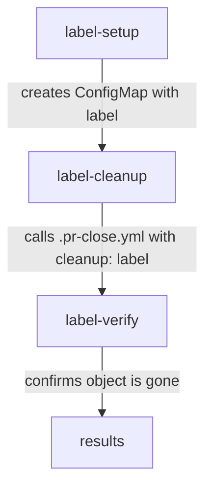

# Plan: Test `.pr-close.yml` with `cleanup: label`

## Problem

No test coverage exists for `.pr-close.yml` using `cleanup: label`. The existing [`cleanup` job](../.github/workflows/pr-open.yml:89) in `pr-open.yml` only tests `cleanup: helm`.

## Flow

## Three new jobs in `pr-open.yml`

### 1. `label-setup` — Create a sacrificial ConfigMap with the right label

- Uses `bcgov/action-oc-runner` (same pinned SHA: `57a28c38359c93e43edf609d35b9a3f50a070131`)
- Creates a ConfigMap named `test-label-cleanup-<PR#>`
- Labels it `app=quickstart-openshift-helpers-<PR#>` — matching the default selector from `.pr-close.yml` line 145
- Verifies it exists before proceeding (sanity check)
- No dependencies on other jobs — runs independently

### 2. `label-cleanup` — Calls `.pr-close.yml` with `cleanup: label`

- `needs: [label-setup]`
- Passes `cleanup: label` and **nothing else** for `cleanup_name` — letting it default to `github.event.repository.name` = `quickstart-openshift-helpers`
- `target` defaults to `github.event.number` = the PR number
- Uses `secrets: inherit` (same pattern as the existing `cleanup` job)
- Side effects: the `remove_pvc` step will fire with its default PVC name but harmlessly echo "Not found" since that PVC won't exist. The `retags` job won't run since `packages` is empty.

### 3. `label-verify` — Confirm the labeled resources are gone

- `needs: [label-cleanup]`
- Uses `bcgov/action-oc-runner` to query: `oc get all,cm,pvc,secret -l app=quickstart-openshift-helpers-<PR#>`
- If any resources remain → `exit 1` (test fails)
- If empty → test passes

### 4. Update `results` job

- Add `label-verify` to the `needs` array so it gates the final status check

## What changes and what doesn't

| File | Change |
|------|--------|
| `pr-open.yml` | Add 3 new jobs + update `results.needs` |
| `.pr-close.yml` | **No changes** |

## Key design decisions

- **ConfigMap** is the simplest OpenShift object to create/verify — no ports, no images, no waiting for pods
- **No `cleanup_name`** passed — exercises the default path which is the whole point of the test
- **No `packages`** passed — avoids triggering the retags job, keeping the test focused on label cleanup only
- The `label-setup` job verifies the ConfigMap can be retrieved by label before handing off (trust-but-verify)
